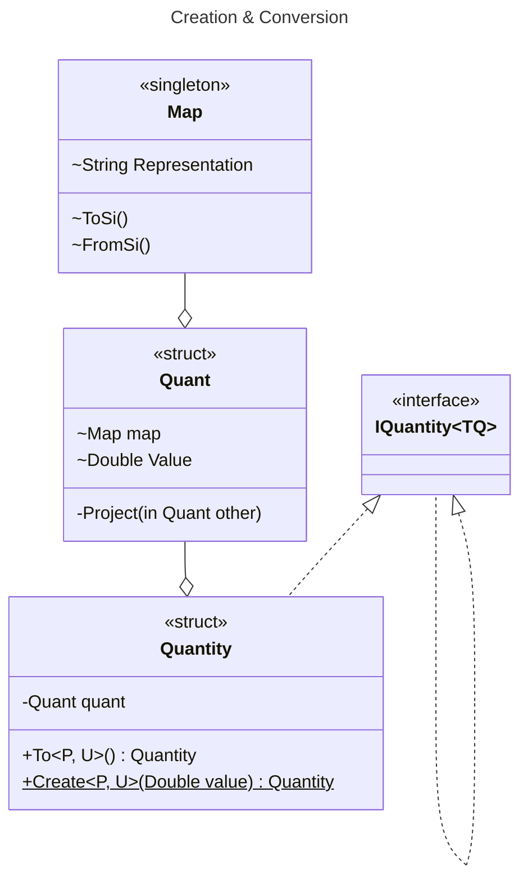

# Architecture

## Concepts

Every...

- quantity is a struct
- quantity has an _internal_ [unit](../quantities/units/IUnit.cs) that is either
    - [SI](../quantities/units/Si/ISiUnit.cs) based
    - [Imperial](../quantities/units/Imperial/IImperial.cs)
    - [other](../quantities/units/Other/IOther.cs)
- SI quantity supports [prefixing](../quantities/prefixes/IPrefix.cs) with
    - a decimal prefix
    - a binary prefix
    - or both
- quantity represents a unique [dimension](../quantities/dimensions/IDimension.cs)
- quantity can only be instantiated using _generic_ factory methods
    - that are parameterized by a combination of generic prefix and unit parameters.
    - The unit parameter is constrained by the same dimension the quantity implements
- quantity is implicitly convertible to a Double
- quantity supports
    - additive operations
    - scalar multiplicative operations
    - comparison to quantities of the same type
- quantity is left associative
    - a compound expression will take the prefix and unit of the left most term
- quantity can be converted to any other valid combination of prefix and unit

Therefore, the actual underlying unit and/or prefix of a given type is an irrelevant detail of any quantity.

## Diagrams

### Decomposition

### Public API

