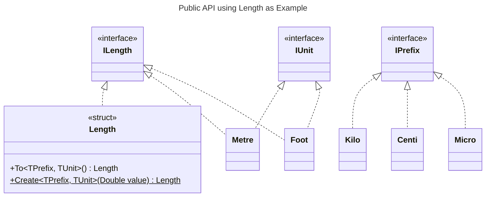
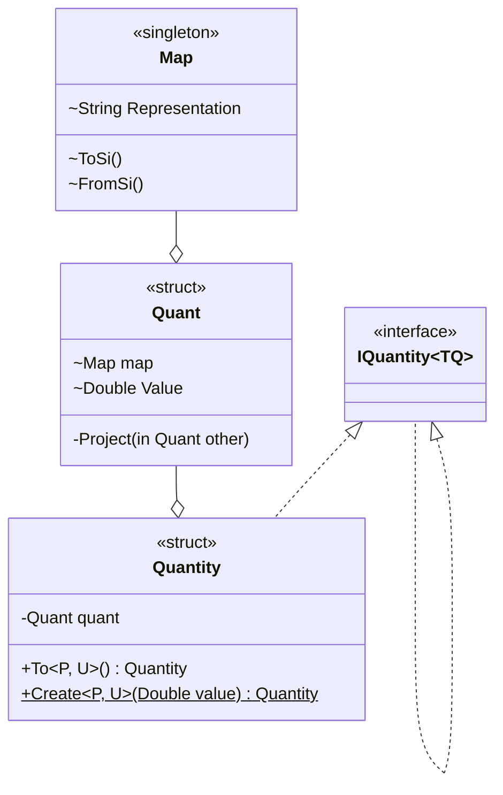

# Design

## Concepts

Every...

- quantity is a struct
- quantity has an _internal_ [unit](../quantities/units/IUnit.cs) that is part of a system of measurements:
  - [SI](../quantities/units/Si/ISiUnit.cs) based
  - [Imperial](../quantities/units/Imperial/IImperial.cs)
  - [no-system](../quantities/units/NonStandard/INoSystem.cs)
- SI quantity supports [prefixing](../quantities/prefixes/IPrefix.cs) with
  - a decimal prefix
  - a binary prefix
  - or both
- quantity represents a unique [dimension](../quantities/dimensions/IDimension.cs)
- quantity can only be instantiated using _generic_ factory methods
  - that are parameterized by a combination of generic prefix and unit parameters.
  - The unit parameter is constrained by the same dimension the quantity implements
- quantity is implicitly convertible to a Double
- quantity supports
  - additive operations
  - scalar multiplicative operations
  - comparison to quantities of the same type
- quantity is left associative
  - a compound expression will take the prefix and unit of the left most term
- quantity can be converted to any other valid combination of prefix and unit

Therefore, the actual underlying unit and/or prefix of a given type is an irrelevant detail of any quantity.

## Public API

This library was built around an API I had in mind. The API should rely heavily on generics, which would make it very easy to use and extend for an arbitrary amount of units and (metric) prefixes.

The minimal API for creation looks like this:

```csharp
public struct TQuantity : IMyDimension
{
    public static TQuantity Create<TPrefix, TUnit>(in Double value)
        where TPrefix : IPrefix
        where TUnit : IMyDimension, IUnit;
}
```

Conversion between units should follow the same pattern, hence:

```csharp
public struct TQuantity : IMyDimension
{
    public TQuantity To<TPrefix, TUnit>()
        where TPrefix : IPrefix
        where TUnit : IMyDimension, IUnit;
}
```

Notice, how the use of the type parameters resembles how one would normally use function arguments. This is a key concept!
Also the generic constraints define what types may be used. For length quantities for instance, it does not make sense to use a unit of `Litre`, as litres are a measure of volume, not length.

Using UML the concept may be illustrated as follows:



Note, that `Length` implements `ILength`, but not `IUnit`!

Creating one kilometre is then as simple as:

```csharp
Length oneKm = Length.Create<Kilo, Metre>(1d);
```

## Decomposition

The implementation of various quantities revolves around a single struct the `Quant` (please excuse the name! There are already too many quantities...).

The quant provides for all the generic conversion capabilities that actual quantities might need to make use of.

Each actual quantity ([Length](../quantities/quantities/Length.cs), [Time](../quantities/quantities/Time.cs), [Velocity](../quantities/quantities/Velocity.cs), etc.) wrap a 'Quant' instance, effectively restricting the operations allowed on that quantity.



## Precision

For now, double precision is used. Once all quantities are implemented, it may be considered making the underlying data type a generic parameter.

For now, it is already complicated enough.

## Realization of Physical Laws

To enable "natural" use of quantities, common physical laws are realised through C# [operator overloading](https://learn.microsoft.com/en-gb/dotnet/csharp/language-reference/operators/operator-overloading).

Modelling physical laws with a C# language construct has proven to be impossible (partially due to some C# language features), hence formulae are implemented using a convention:

```text
The type of the leftmost input parameter determines on which type the formula is to be implemented.
```

Say, Ohm's law ($V = R \cdot I$) is to be implemented. Then four separate formulae, in union consisting of Ohm's law, need to be implemented:

- $V = R \cdot I$
- $V = I \cdot R$
- $R = V \, / \, I$
- $I = V \, / \, R$

 Hence, this results in four overloads implemented on three structs:

```csharp
public readonly struct Voltage
{
    // ...
    public static Resistance operator /(Voltage left, Current right);
    public static Current operator /(Voltage left, Resistance right);
}

public readonly struct Current
{
    // ...
    public static Voltage operator *(Current left, Resistance right);
}

public readonly struct Resistance
{
    // ...
    public static Voltage operator *(Resistance left, Current right);
}
```

This convention makes it easy to locate the relevant implementation in the source code.

## Definitions & Spelling

All definitions are rooted in the [international system of units - SI](https://en.wikipedia.org/wiki/International_System_of_Units). When there are conflicting definitions, SI always takes precedence.

This also holds true for spelling. SI spelling takes precedence.

For imperial units the british definition and spelling are used.
