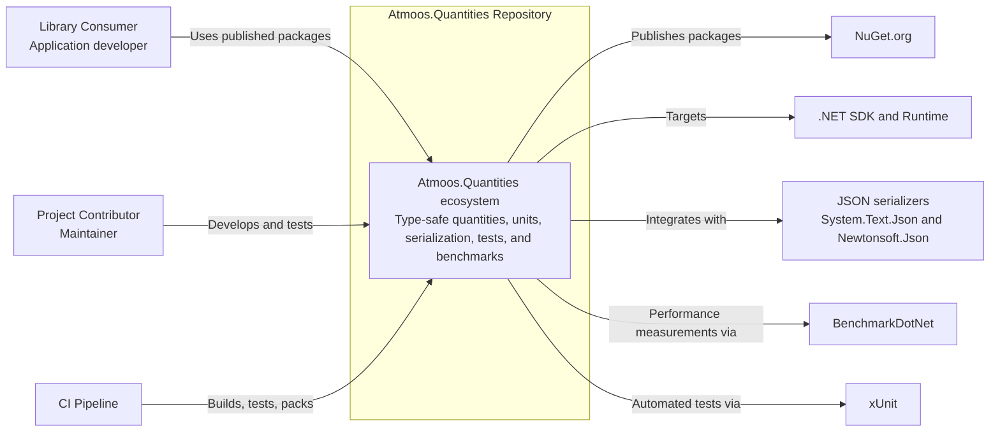
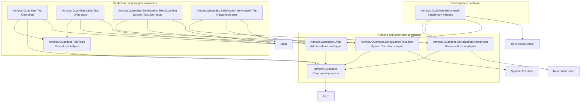
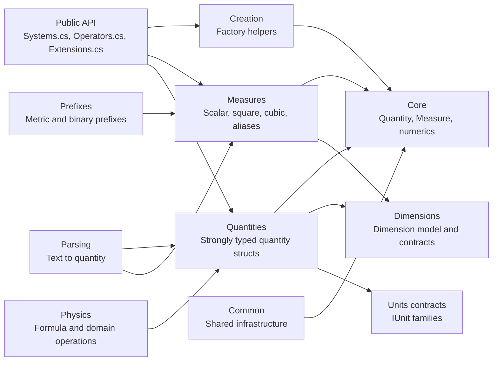
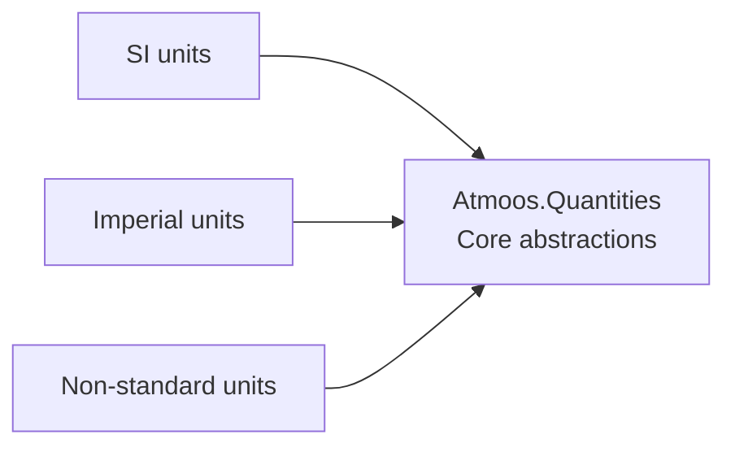
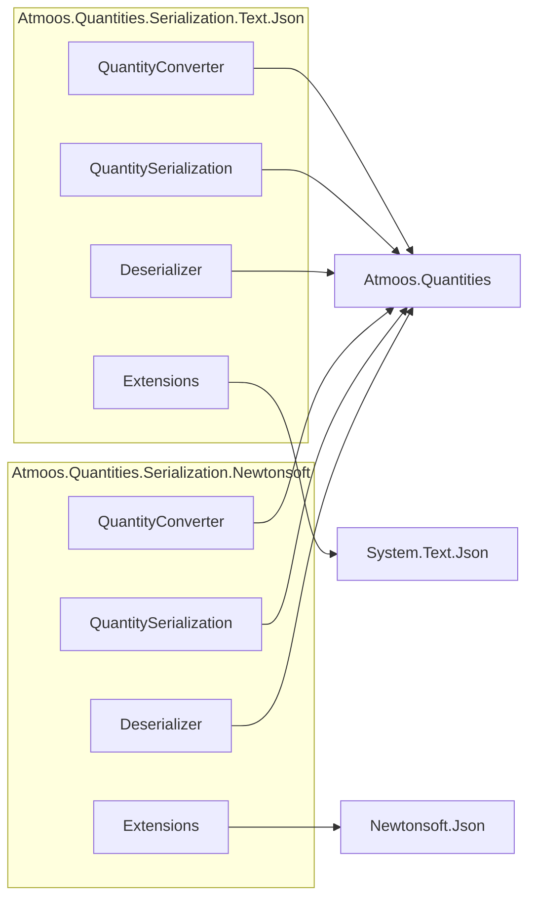
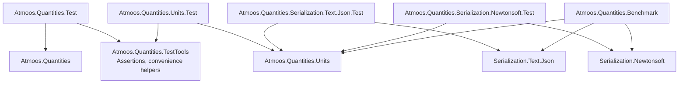

# Architecture

This document describes the repository architecture using C4-style models.

Scope:

- Solution: `source/Atmoos.Quantities.sln`
- Projects modelled: all C# projects currently included in the solution

## C4 Level 1: System Context

## C4 Level 2: Container View (Projects)

Each C# project is modelled as a container.

## C4 Level 3: Component Views

## Atmoos.Quantities (Core)

Primary components are represented by top-level folders and public entry points.

## Atmoos.Quantities.Units

## Serialization Adapters

## Verification and Benchmarks

## Project Inventory

- Atmoos.Quantities: core runtime container
- Atmoos.Quantities.Units: extension unit catalogue container
- Atmoos.Quantities.Serialization.Text.Json: System.Text.Json adapter container
- Atmoos.Quantities.Serialization.Newtonsoft: Newtonsoft.Json adapter container
- Atmoos.Quantities.TestTools: shared testing support container
- Atmoos.Quantities.Test: core behaviour and regression tests container
- Atmoos.Quantities.Units.Test: units coverage tests container
- Atmoos.Quantities.Serialization.Text.Json.Test: System.Text.Json adapter tests container
- Atmoos.Quantities.Serialization.Newtonsoft.Test: Newtonsoft adapter tests container
- Atmoos.Quantities.Benchmark: performance measurement container

## Notes

- The container relationships are based on current project references in the solution.
- Component decomposition is intentionally coarse-grained at folder and entry-point level to remain maintainable as code evolves.
