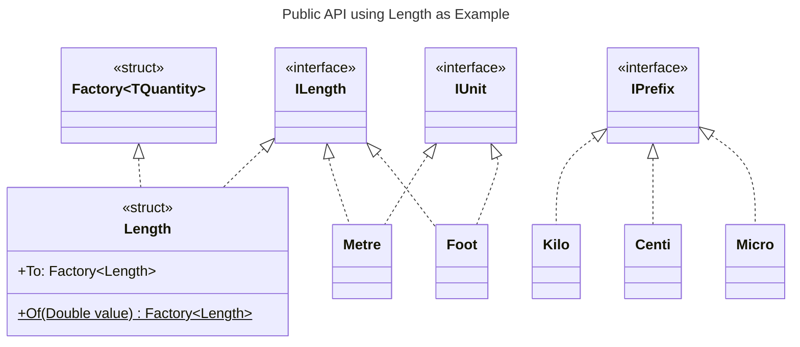
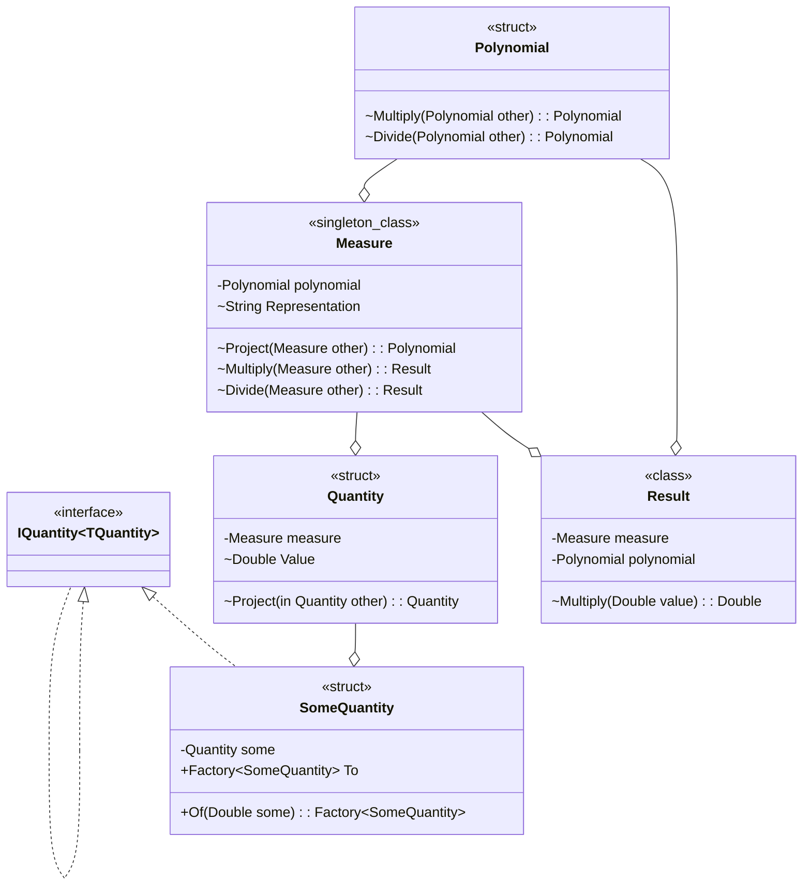

# Design

This library was started as an attempt to create a user (developer) friendly api with which to handle quantities. Therefore, user friendliness stands at it's core.

It is intended to solve the ambiguity faced when dealing with physical units. Represented here by the umbrella term "quantities".

## Principles

There are some core principles that govern the design of this library. This library...

- is domain agnostic.
  - Hence, we make no assumptions of what users might wan't to model.
  - Nor what kind of data would be modelled.
- does not validate input.
  - As long as it's a valid `Double`, we'll take it.
  - Example: A negative `Length` is a valid value. (It's a valid floating point value.)
  - If users need to constrain the value of a quantity, they'll need to do that themselves.
  - This includes "Divide by zero" scenarios, which we leave to .Net to handle.
- is designed to be **precise**.
  - It achieves better than `Double` precision in many cases.
  - ToDo: examples!
- is designed to be **fast**.
  - It's not as fast as using `Double` directly though. But it's fast, really fast.
  - However, precision is prioritized over speed.
- aims to avoid memory allocations.
  - This holds true for all quantities.
- defines units and prefixes by types, not values.
  - This allows users to easily [use their own](../source/Quantities.Test/UserDefined.cs) units.
  - We don't see a scenario for user defined prefixes, but it's possible to **precise**do none the less.

## Design Decisions

Every...

- quantity is a struct
- quantity has an _internal_ [unit](../source/Quantities/Units/IUnit.cs) that is part of a system of measurements:
  - [SI](../source/Quantities/Units/ISiUnit.cs) (which includes [Metric](../source/Quantities/Units/IMetricUnit.cs))
  - [Imperial](../source/Quantities/Units/IImperial.cs)
  - [non-standard](../source/Quantities/Units/INonStandardUnit.cs)
- quantity supports [prefixing](../source/Quantities/Prefixes/IPrefix.cs) of units on SI, metric or binary units with
  - a decimal prefix
  - a binary prefix
  - or both
- quantity represents a unique [dimension](../source/Quantities/Dimensions/IDimension.cs), such as one of the seven [BaseDimensions](../source/Quantities/Dimensions/BaseDimensions.cs)
- quantity can only be instantiated using _generic_ factory methods
  - that are parameterized by a combination of generic prefix and unit parameters.
  - The unit parameter is constrained by the same dimension the quantity implements
- quantity is implicitly convertible to a `Double`
- quantity supports
  - additive operations
  - scalar multiplicative operations
  - comparison to quantities of the same type
- quantity is left associative
  - a compound expression will take the prefix and unit of the left most term
- quantity can be converted to any other valid combination of prefix and unit

Therefore, the actual underlying unit and/or prefix of a given type is an _irrelevant detail_ of any quantity.

## Public API

This library was built around an API I had in mind. The API should rely heavily on generics, which would make it very easy to use and [extend](../source/Quantities.Test/UserDefined.cs) for an arbitrary amount of units and (metric) prefixes.

There are factories (interfaces) for each system of measurement (Si, Metric, Imperial, etc.) that define what prefixes and units may be used:

```csharp
public struct Factory<TQuantity> : ISystemFactory
{
    public TQuantity System<TPrefix, TUnit>()
        where TPrefix : IPrefix
        where TUnit : IMyDimension, IUnit;
    
    // other factory methods, depending on the system of measurement...
}
```

The API for conversion and creation looks like this:

```csharp
public struct TQuantity : IMyDimension
{
    public Factory<TQuantity> To { get; };
    public static Factory<TQuantity> Of(in Double value);
}
```

Thus, allowing for concise and expressive handling of units:

```csharp
Length metric = Length.Of(100).Si<Milli, Metre>();
Length imperial = Length.Of(23).Imperial<Foot>();
Length otherMetric = metric.To.Si<Kilo, Metre>();
```

Notice, how the use of the type parameters resembles how one would normally use function arguments. This is a key concept.
Also, the generic constraints define what types may be used. For length quantities for instance, it does not make sense to use a unit of `Litre`, as litres are a measure of volume, not length.

Using UML the concept may be illustrated as follows:



Note, that `Length` implements `ILength`, but not `IUnit`!

Creating one kilometre is then as simple as:

```csharp
Length oneKm = Length.Of(1d).Si<Kilo, Metre>();
```

## Decomposition

The implementation of various quantities revolves around three core types:

- [Polynomial](../source/Quantities/Core/Numerics/Polynomial.cs)
  - Does all the numerical heavy lifting.
- [Measure](../source/Quantities/Core/Measure.cs)
  - The manifestation of a dimension as vector in the dimension space.
  - Where the base si dimensions are the span of that vector space.
  - Each measures `Polynomial` can be though "magnitude" of the dimension vector.
  - Can safely be represented as a singleton, meaning allocation is asymptotically zero.
- [Quantity](../source/Quantities/Core/Quantity.cs)
  - Holds the _scalar_ scaling factor of a physical quantity, as a `Double`.
  - The `Measure` defines "direction" and "magnitude".
  - Exposes all functionality any actual quantity may need.

Each actual quantity ([Length](../source/Quantities/Quantities/Length.cs), [Time](../source/Quantities/Quantities/Time.cs), [Velocity](../source/Quantities/Quantities/Velocity.cs), etc.) wraps a 'Quantity' instance, effectively restricting the operations allowed on that quantity.



## Precision

This library achieves at least `Double` precision. By use of the [Polynomial](../source/Quantities/Core/Numerics/Polynomial.cs) type, we often can achieve better than `Double` precision.

## Realization of Physical Laws

To enable "natural" use of quantities, common physical laws are realised through C# [operator overloading](https://learn.microsoft.com/en-gb/dotnet/csharp/language-reference/operators/operator-overloading).

Modelling physical laws with a C# language construct has proven to be impossible (partially due to some C# language features), hence formulae are implemented using a convention:

```text
The type of the leftmost input parameter determines on which type the formula is to be implemented.
```

Say, Ohm's law ($V = R \cdot I$) is to be implemented. Then four separate formulae, in union consisting of Ohm's law, need to be implemented:

- $V = R \cdot I$
- $V = I \cdot R$
- $R = V \, / \, I$
- $I = V \, / \, R$

 Hence, this results in four overloads implemented on three structs:

```csharp
public readonly struct Voltage
{
    // ...
    public static Resistance operator /(Voltage voltage, Current current);
    public static Current operator /(Voltage voltage, Resistance resistance);
}

public readonly struct Current
{
    // ...
    public static Voltage operator *(Current current, Resistance resistance);
}

public readonly struct Resistance
{
    // ...
    public static Voltage operator *(Resistance resistance, Current current);
}
```

This convention makes it easy to locate the relevant implementation in the source code.

## Definitions & Spelling

All definitions are rooted in the [international system of units - SI](https://en.wikipedia.org/wiki/International_System_of_Units). When there are conflicting definitions, SI always takes precedence.

This also holds true for spelling. SI spelling takes precedence.

For imperial units the british definition and spelling are used.

### Naming

The naming of units and prefixes follows the definitions given by the [International System of Units](https://en.wikipedia.org/wiki/International_System_of_Units) (SI). If no naming can be found there, the consensus formed on the corresponding english Wikipedia page will be used.
This leads to the following list of naming conventions:

- We use the _international_ name as defined by SI or Wikipedia
  - Many units are named after individuals. We respect the way they spell their own name.
  - Hence we use [Ångström](../source/Quantities.Units/Si/Metric/Ångström.cs), not "Angstrom".
  - We can do this since C# source code is UTF-8 and supports special characters
- Potential duplicate names are resolved via namespaces.
  - Examples are the well known unit of force, the [Newton](../source/Quantities.Units/Si/Derived/Newton.cs) and the lesser known unit of temperature, the [Newton](../source/Quantities.Units/NonStandard/Temperature/Newton.cs).
